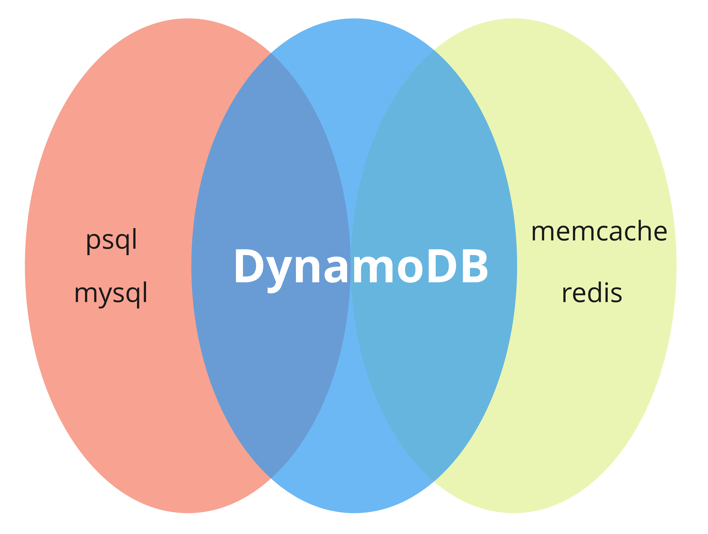

# Começando com DynamoDB

Uma apresentação sobre DynamoDB

--- 

# Começando (direito) com DynamoDB

(ou tudo o que você queria saber sobre DynamoDB e não sabia como perguntar, nem pra quem, nem quando. ou aquilo que você não sabia sobre o DynamoDB. ou tudo aquilo que não te falaram sobre um banco de dados barato e com algumas características incomuns)

---

 
Eu sou o **erick müller**. no twitter também sou @oerickmuller, e no instagram também. 

Você vai aprender com alguém que trabalha com DynamoDB há alguns anos. e vai aprender sem cometer os erros que eu cometi. 

---

# O que é o DynamoDB?

*Em uma linha:* é um mecanismo de armazenamento de dados focado em busca rápida/eficiente. 

Não é apenas **banco de dados**.
Mas não é apenas **armazenamento chave valor**. 

É uma mistura dos dois. Com prós e contras. 

---

# Aviso

Aqui vai ser bem hands-on, eu quero mostrar **como** usar, e como sair do zero para o uso diário. 

Para mais informações técnicas, consulte sempre a documentação da AWS. 

*(inclusive precisamos de uma certificação para validar conhecimento em navegação de documentação da AWS)*

---

# Criando tabelas de dados

Usamos as tabelas de dados para armazenar documentos, indexados a partir de um campo (chamado INDEX, ou HASH), podendo adicionar um novo campo de ordenacao (SORT, ou RANGE)

As tabelas **não** tem relacionamento entre si, seja entre dados internos ou externos.

Na criação da tabela definimos apenas os campos de índice (um ou dois). E definimos como vamos pagar pelo acesso aos dados (provisionado/sob demanda).

---

# Tipos de dados (incompleto)

- S: Texto
- N: Numero

--- 

<!--
_color: black
_backgroundColor: gray
-->

(hora da demonstração, parte 1)

---

# Inserindo dados 

- manualmente, usando o AWS Console ou usando o AWS CLI
- usando bibliotecas/apis fornecidas pela AWS. 

Único campo obrigatório é o campo de índice, mas se a tabela tem um campo de ordem, o campo é obrigatório também. 

Do resto, quantos campos quiser.  Mesmo que não existam na definição da tabela.

--- 

# Tipos de dados (completo)

- S: Texto
- N: Numero
- BOOL: Booleano
- NULL: Nulo
- B: Binário
- L: Lista
- M: Map
- NS, SS, BS: conjunto (não repetido) de N, S e B

---

<!--
_color: black
_backgroundColor: gray
-->

(hora da demonstração, parte 2)

---

# Buscando dados

Através do campo de índice, usamos o comando/função **Query**. A busca é direta, mais barato e mais rápido.

Para buscar por outros campos, usamos o comando/função **Scan**. A busca é sequencial e em toda a tabela. É mais caro e mais lento. *E quanto mais itens, mais caro e mais demorado*.

---

# Índices secundários

Novas **visões** de uma tabela, indexando pelo(s) campo(s) desejado(s) e considerando apenas os campos desejados (*isso é opcional*).

**Benefícios**:

- mais de um tipo de pesquisa para a mesma tabela, pagando menos (o armazenamento do índice é cobrado) 
- restrição de acesso a dados (conjuntos menores de dados para busca)

---

# Tipos de índices secundários

## Local (LSI)

Usa o campo de índice existente como base, e adiciona um novo campo de ordenação.

## Global (GSI)

Usa qualquer campo para índice e ordenação.  

---

<!--
_color: black
_backgroundColor: gray
-->

(hora da demonstração, parte 3)

---

# Dicas

- desenhe seu armazenamento com o foco na velocidade e eficiência da busca! O DynamoDB não é um banco de dados relacional. Achar que o DynamoDB é um banco de dados relacional é um passo para a decepção. 

- comece sempre com o modelo de cobrança **sob-demanda**. Se necessário, mude para o provisionado, que pode ajudar em previsão de custo mas pode bloquear o acesso aos dados.

- não use scan na tabela toda, a não ser que seja para obter realmente todos os dados. 

- se estiver programando e precisar fazer acesso aos dados, lembre-se da paginação.

--- 

# É isso.

Obrigado pela atenção, e me chamem para conversar, tirar dúvidas ou algo assim. 

@orickmuller em todas as redes, erick@em.pro.br no e-mail.
