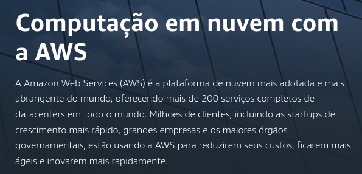

# Migrando para a AWS: Uma experiência (nada) simples

"veni, vidi, migrati"
- *Julio Cesar*
--- 

 
Eu sou o **erick müller**. no twitter também sou @oerickmuller, e no instagram também. 

O que eu estou contando aqui são experiências pessoais de quem já fez algumas migrações para a nuvem AWS. Entendam isso como um compartilhamento de ideias, e não como um livro de regras.

---

# O que é a AWS?

*Em uma linha:* datacenter na nuvem + ferramentas para possibilitar e melhorar a entrega de ótimas soluções.

E se perguntar pra AWS? [Aqui está a resposta](https://aws.amazon.com/pt/what-is-aws/)

---

<!--
_color: black
_backgroundColor: lightyellow
-->

E pra **você**, o que é a AWS? 

*Já parou pra pensar nisso?*

---

# Migração não é tarefa, é projeto, é processo. Precisa de plano.

Precisa saber três coisas:

- Porque deseja migrar?
- Quais são as vantagens esperadas?
- Quem vai ajudar na tarefa?

---

<!--
_color: black
_backgroundColor: gray
-->

momento história: **contratado pra migrar**

---

# O papel do arquiteto especialista de cloud

- Adequação da estrutura - VPC, Security Groups
- Análise das arquitetura das aplicações
- Análise das soluções usadas.

---

um fato da vida: **nem tudo será migrado**. 

outro fato da vida: **em algum momento você vai duvidar disso**

---

A realidade de uma empresa que nasce na nuvem é diferente de uma empresa que migra para a nuvem. 

O legado de uma empresa, seja aplicações, servidores ou serviços terceiros, tem que ser avaliado caso-a-caso.

---

<!--
_color: black
_backgroundColor: gray
-->

momento história: **perdendo contrato pra ganhar paz**

---

# Angariando ajuda

Ninguém faz isso se não contar com:

- o compromisso explícito dos cargos superiores (C-level)
- o entendimento completo e inequívoco de todas as pessoas envolvidas (usuários e pessoas de TI)
- o envolvimento de todas as pessoas que estão comprometidas com o processo.

--- 

# Modos de migração 

1. Novos na nuvem, atuais "onde estão"

Tende a ser mais demorado, mas mais seguro. Pode causar a infrankenstein.

2. Migração em partes

Migra uma coisa por vez, até migrar tudo. Só precisa definir a ordem de migração e o que significa esse tudo. É uma das mais usadas.

--- 

# Modos de migração 

3. Migração em blocos

Migra um bloco de cada vez: um grupo de aplicações, um conjunto de recursos (banco de dados, por exemplo). 

4. Migração caminhão de mudança. 

Migra tudo. Eu nunca testemunhei uma dessa, mas sei de histórias em que aconteceu e deu muitos problemas. Pode funcionar bem para pequenas operações. 

---

# Modos de maturidade na nuvem

## Datacenter na nuvem

Olha pra nuvem como se fosse um datacenter onde as coisas andam mais rápido, por exemplo provisionamento de equipamentos.

## Operação na nuvem

Datacenter na nuvem + alguns serviços gerenciados (RDS, S3)

## Solução na nuvem

Usa mais serviços gerenciados e menos itens de infraestrutura que demandam manutenção. Soluções na nuvem (Lambda, API Gateway, Sagemaker)

---

# Dicas

- Mantenha o billing sob controle. Tenha isso alinhado com todos os envolvidos. 

- Mantenha todos na mesma página, e fale com todos os envolvidos na linguagem deles. O time financeiro quer saber de contas e TCO? Tenha isso na mão. O time de atendimento ao cliente precisa saber que dias as instabilidades podem acontecer? Seja transparente.

- Migração não é só procedimento técnico. 

- Tenha pessoaS com conhecimento de AWS comprometidas com o projeto, não apenas para "dar uma dica". Corrigir algo errado costuma ser mais caro.

- Migração é rally, não é Fórmula 1.

---

# É isso.

Obrigado pela atenção, e me chamem para conversar, tirar dúvidas ou algo assim. 

@orickmuller em todas as redes, erick@em.pro.br no e-mail.
